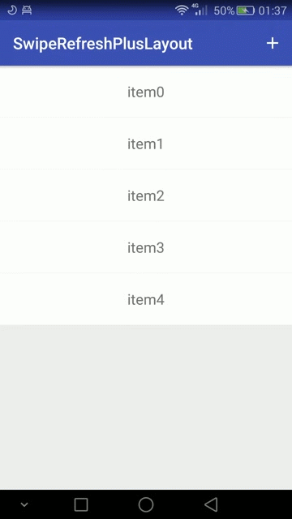
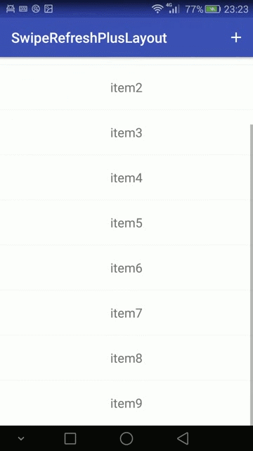

# SwipeRefreshPlusLayout  
[  ](https://bintray.com/lynnchurch/maven/swipe-refresh-plus-layout/_latestVersion)

# Description
Expand the function of loading more to android.support.v4.widget.SwipeRefreshLayout.  

  

# Usage
**1.** Add a dependency to your `build.gradle`:
```
dependencies {
    compile 'me.lynnchurch:swipe-refresh-plus-layout:1.2.0'
}
```

**2.** Add the `me.lynnchurch.swiperefreshplus.SwipeRefreshPlusLayout` to your layout XML file:
```xml
 <me.lynnchurch.swiperefreshplus.SwipeRefreshPlusLayout
        android:id="@+id/swipe_refresh"
        android:layout_width="wrap_content"
        android:layout_height="wrap_content"
        app:layout_behavior="@string/appbar_scrolling_view_behavior">
        <android.support.v7.widget.RecyclerView
            android:id="@+id/rv_items"
            android:layout_width="match_parent"
            android:layout_height="match_parent"
            android:scrollbars="vertical"/>
 </me.lynnchurch.swiperefreshplus.SwipeRefreshPlusLayout>
```

**3.** Add the code of loading more(the code of refresh is the same with android.support.v4.widget.SwipeRefreshLayout):
```java
    // enable the function of loading more
    swipe_refresh.setLoadMoreEnable(true);
    // set the animation colors of loading more
    swipe_refresh.setLoadMoreColorSchemeResources(R.color.swipe_color_1);
    // set the OnLoadMoreListener
    swipe_refresh.setOnLoadMoreListener(new SwipeRefreshPlusLayout.OnLoadMoreListener()
    {
        @Override
        public void onLoadMore()
        {
            simulateLoadMoreData();
        }
    });
```
